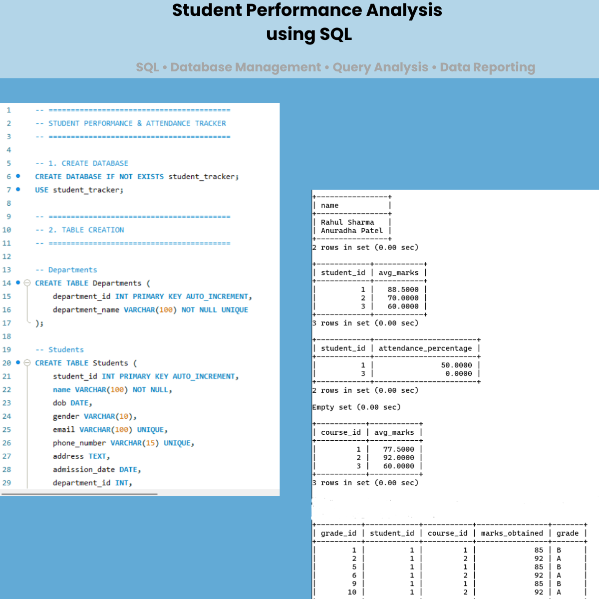

# 🚀 Student Performance Analysis using SQL

A beginner-friendly SQL project focused on student performance tracking, attendance management, and database reporting concepts.

## 📌 About This Project
This repository contains:
- Student performance analysis
- Attendance tracking system
- Database creation and management
- SQL query analysis
- Reporting and aggregation techniques
- Beginner-friendly database exercises

## 📂 Files Included
- `STUDENT PERFORMANCE & ATTENDANCE TRACKER.sql` → SQL file containing database queries and analysis operations
- `Student_Performance_Analysis_using_SQL.png` → Output screenshot of the SQL project

## 🛠 Technologies Used
- SQL
- MySQL

## 🎯 Learning Goals
This project helps in understanding:
- Database management concepts
- Student performance tracking
- Attendance analysis
- SQL query execution
- Reporting and aggregation techniques

## 📸 Project Output

## 👨‍💻 Author
**Yashraj Sharma**

---
⭐ If you like this project, don't forget to star the repository.
